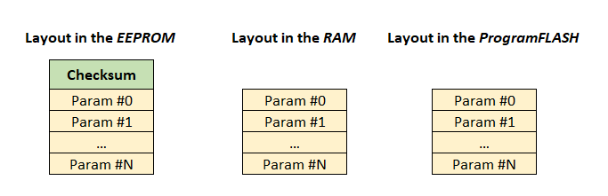
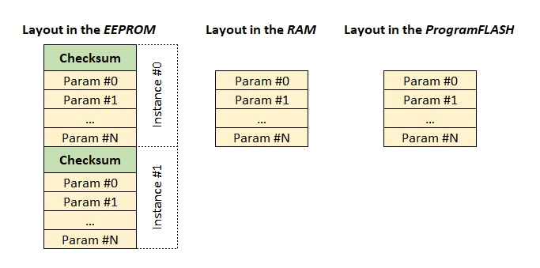
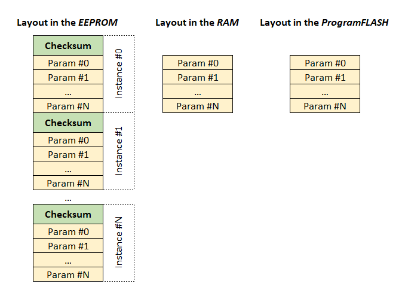
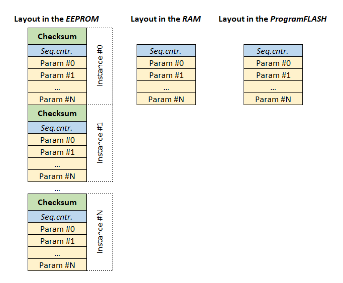
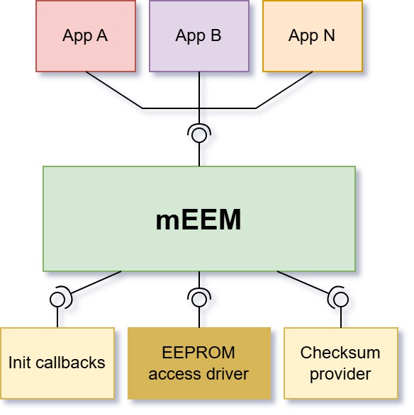

# Principle of operation
## Preface
Today's EEPROMs have 3 distinct features:  
- Write operations take *a lot* of time (several milliseconds)  
- Write operations don't stall the CPU (well, with some extremely rare exceptions among on-chip EEPROMs on some MCUs)  
- They can't be read while being written  

## Concept
- Treatment of all EEPROMs as serial devices.  
- Guaranteed non-concurrent read and write operations.  
- Centralized management of all EEPROM data.     
- Separate contexts for distinct application concerns (i.e. `blocks`, see below).  
- *Parameter*s as basic data units, provided to applications, with any primitive scalar type in [C99](https://en.wikipedia.org/wiki/C99), or array of them.  
- Multiple *parameters* organized into *blocks*.  
- Static EEPROM partitioning with fixed addresses, known at compile time.  
- Distinct EEPROM management types for *blocks*, based on use case and expected write frequency: 

| Block management type | Use case                                                                       | Expected write frequency |
| --------------------- | ------------------------------------------------------------------------------ | ------------------------ |
| *Basic*               | For general use                                                                | Low to moderate          |
| *BackupCopy*          | Data with enhanced reliability                                                 | Low                      |
| *MultiProfile*        | Multiple parameter sets of the same type (*user profiles*), switchable runtime | Low to moderate          |
| *Wear-leveling*       | Frequently changed data                                                        | High                     |

#### What does *low*, *moderate* and *high* write frequency mean?

| Write frequency | Number of writes per block per power cycle, on average |
| --------------- | ------------------------------------------------------ |
| Low             | Less than 1                                            |
| Moderate        | Up to 10                                               |
| High            | At least 10                                            |

- By `data`, we'll understand a *collection of all parameters within a block*.

## Block memory layout and management types
- A block has instances in 3 types of memory: *EEPROM*, *RAM* (data cache) and *Program FLASH* (default values). Each memory area is contiguous.
- A block has a variable number of data instances in EEPROM, depending on its management type. Each instance features a `checksum`, prepended to the `data`. The `checksum` is calculated over the data and has a configurable size of 1, 2 or 4 bytes.
- A block has a single instance of data in the RAM.
- A block has a single instance of data in the Program FLASH memory. To save memory, the *mEEM* may try to deduce the shortest possible pattern from default values you've defined in the [*EEPROM data model*](../README.md#18). In some scenarios, that may yield substantial savings. Pattern deduction is a configurable option.  
  For simplicity, the following diagrams illustrate the full (non-compressed) layout of defaults.

### Basic
These blocks have the smallest memory footprint and usually are default choice.  

### BackupCopy
These blocks have double the EEPROM footprint, compared to *Basic* blocks, but that's the price for the enhanced reliability. Use such blocks for storage of rarely changed data.  
On initialization, *always both* EEPROM instances are read and validated.  
On write, *always both* EEPROM instances are written.  

                                                      
### Multi-profile
With these blocks, only one EEPROM instance (i.e. the `active profile`) can be used at a time, just like a *Basic* block, but the instance is selectable at runtime.  
If the `active profile` needs to be switched, a wait is required (while the new instance is being fetched). The block is unusable during the switch-over.  
On initialization, the user is required to provide an ID of the initially selected profile via [callback](../src/required_interface/MEEM_UserCallbacks.h#29).  
On write, only the `active profile` is written to the EEPROM.  

### Wear-leveling
As their name suggests, these blocks distribute the EEPROM wear within their managed area by performing each write to a different EEPROM instance.  
The underlying implementation is a [circular buffer](https://en.wikipedia.org/wiki/Circular_buffer), and they feature a `sequence counter` (`Seq.cntr.` in the diagram below) - it is used to identify the most recently written instance.  
The `sequence counter` has a fixed size of 1 byte and is considered part of the `data` - it's also included in the checksum calculation.  
On initialization, *all* EEPROM instances are read and validated. When the most recent valid one is found, it is used to initialize the cache.  
On each write, the `sequence counter` is pre-incremented.  

## Runtime management
- *Blocks* are initialized in definition order from the `EEPROM-data-model.json`. Default values will be loaded into the block's cache if the EEPROM data is found to be invalid.    
- Pending write and/or fetch requests are processed in round-robin manner.  
- *Block*'s data is always written and read together, at once.  

## API
The following diagram closely illustrates the content of the [src](../src/) folder.  
Above the **mEEM** are the client components, that use the *provided interface*: [MEEM.h](../src/provided_interface/MEEM.h)  
Below the **mEEM** are the components, implementing the *required interface*: [MEEM_UserCallbacks.h](../src/required_interface/MEEM_UserCallbacks.h), [MEEM_EEAIF.h](../src/required_interface/MEEM_EEAIF.h), [MEEM_Checksum.h](../src/required_interface/MEEM_Checksum.h)  

## "A picture is worth a thousand words"
Refer to [the complete example](../example/Microchip/) to understand how all this works in practice.

## Notes on the EEPROM access driver
The robustness of the **mEEM** depends heavily on the used EEPROM access driver. A well-designed driver is expected to:  
- Return `NotOk` status only if something _really_ goes wrong.  
If a read/write failure occurs, several retries (usually 2-3) should be made before returning `NotOk`. This is _a must_ for external serial EEPROMs.  
- Perform difference check with the actual EEPROM content, before each requested _write_ operation.  
While this technique will greatly reduce the EEPROM wear-out, it will incur runtime overhead, especially with external serial EEPROMs. Although, it would be completely justified for write-intensive applications.  
